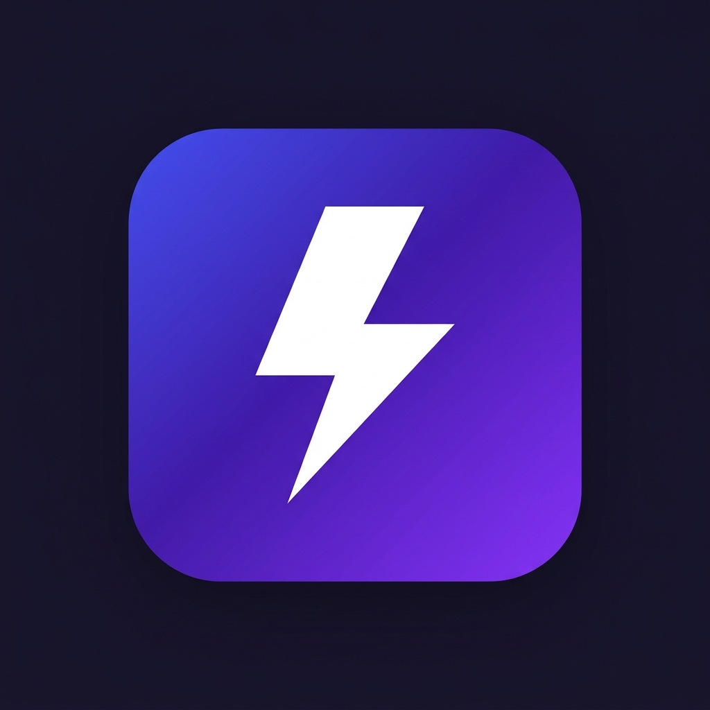

# ⚡ Smart TL;DR — AI Chrome Extension

A modern, fast, and highly customizable browser extension that uses AI to instantly summarize any webpage. Instead of generic walls of text, it detects the type of page you're reading (Job Listing, Article, Product, Research Paper, Video) and outputs perfectly structured, scannable cards.

## ✨ Features

- **Smart Categorization**: Automatically identifies page types and extracts exactly what matters. For a job listing, it grabs role, salary, and hard requirements. For a product, it extracts price and value proposition.
- **Multi-Provider Support**: Bring your own API key! Works seamlessly with:
  - Gemini (Google)
  - OpenAI (ChatGPT)
  - Anthropic (Claude)
  - Ollama (Local AI, 100% private, free)
  - LM Studio (Local AI, 100% private, free)
- **Zero-Friction UI**: A beautiful, draggable, resizable, glassmorphic floating popup injected right into your page. It adaptive-themes itself to match the website's colors.
- **Copy Options**: One-click copy for rendered text, or raw markdown.
- **Full History**: Access your past summaries through a beautifully organized, searchable history dashboard.
- **Gen-Z Loading Animations**: Enjoy phrases like "reading the vibes..." and "scanning for tea ☕" while you wait.

## 🚀 Installation (Load Unpacked)

Since this is a developer version, you'll need to load it manually into Chrome (or Edge/Brave):

1. **Download/Clone** this repository to your computer.
2. Open your browser and navigate to the Extensions page:
   - Chrome: `chrome://extensions/`
   - Edge: `edge://extensions/`
   - Brave: `brave://extensions/`
3. Toggle on **Developer mode** (usually a switch in the top right corner).
4. Click the **Load unpacked** button.
5. Select the folder containing this repository (`tldr-ext`).
6. The extension is now installed! Pin the ⚡ icon to your toolbar for easy access.

## ⚙️ Configuration & Usage

1. **Set your API Key**: Right-click the extension icon in your toolbar and select **Options**. 
2. Choose your preferred AI provider:
   - *Gemini*: Uses `gemini-2.0-flash` by default. Free tier available via Google AI Studio.
   - *OpenAI*: Uses `gpt-4o-mini` by default.
   - *Anthropic*: Uses `claude-sonnet-4` by default.
   - *Ollama / LM Studio*: Completely free and local. Ensure your local server is running.
3. Enter your API key and click **Save**. You can also click **Test Connection** to ensure it works.
4. **Summarize**: Click the extension icon on any webpage to toggle the Smart TL;DR. The floating popup will appear and begin extracting the key information.

## 🛠️ Architecture

- **Manifest V3**: Built using modern, secure Chrome extension standards.
- **Vanilla JS & CSS**: No heavy frameworks. Fast execution and zero bloat.
- **Shadow DOM**: The popup UI is completely isolated from the host website's CSS, preventing styling conflicts.
- **Service Worker (`background.js`)**: Manages state, API calls (bypassing CORS), and history caching limits.

## 📄 Customizing Prompts

You can tweak the exact extraction rules and word limits by editing the `SYSTEM_PROMPT` inside `background.js` and `prompt.md`. 
*Note: If you make changes to the code, go back to `chrome://extensions/` and click the refresh ↻ icon on the extension card.*

---
*Built for power users who hate reading filler.*
